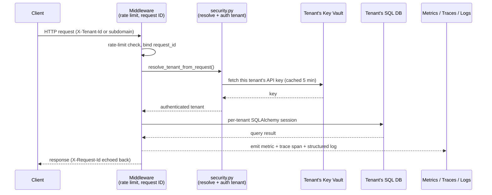

# TutorTrack — Multi-Tenant SaaS Starter Kit

A scheduling/billing platform for tutoring centers, built to
demonstrate isolated, automatically-provisioned, and **observable**
tenant infrastructure on Azure — the architecture problem behind most
real B2B SaaS products, not just the CRUD features on top of it.

[](.github/workflows/ci.yml)

## The core problem this solves

Most "multi-tenant" tutorials use a shared database with a `tenant_id`
column on every table. That's cheap and simple, but it means a single
missing `WHERE tenant_id = ?` clause anywhere in the codebase leaks
one customer's data to another. For a platform handling other
people's business and student data, that's not an acceptable risk
surface for the sake of saving infrastructure cost.

## Isolation model chosen: dedicated DB + Key Vault + storage per tenant

| Model | Isolation strength | Cost/complexity | Chosen? |
|---|---|---|---|
| Shared schema (`tenant_id` column) | Weak — one bug leaks everything | Lowest | No |
| Shared server, dedicated DB per tenant | Strong — DB-level boundary | Medium | **Yes** |
| Dedicated server per tenant | Strongest | Highest, hard to scale to 1000s of tenants | No (but documented as a future tier for enterprise customers) |

This is the tradeoff to walk an interviewer through: the strongest
isolation isn't always the right choice at every scale — dedicated DB
per tenant, on a shared logical server, is the reasonable middle
ground for an early-stage SaaS.

## Architecture

```
terraform/
  modules/tenant/       <- one module call = one fully isolated tenant environment
  modules/monitoring/   <- Log Analytics + App Insights + alerting, shared across tenants
  main.tf                <- shared infra (SQL server, ACR, Container App, app identity) + tenant loop
  tenants.auto.tfvars.json  <- the tenant registry (source of truth for who exists)

app/
  main.py                 <- wires middleware, exception handlers, observability, routers
  config.py                 <- all runtime config, validated at boot (pydantic-settings)
  tenant_context.py          <- resolves tenant per-request, fetches ITS OWN secrets
  security.py                  <- per-tenant API key auth
  database.py                    <- per-tenant DB engine, never shared across tenants
  deps.py                          <- forces every route through tenant resolution + auth
  middleware.py                     <- request ID, structured log context, rate limiting
  observability.py                    <- OpenTelemetry tracing + Prometheus metrics wiring
  logging_config.py                     <- structured JSON logs, trace-correlated
  routers/                                <- domain API (students, sessions, health)
  tests/                                    <- pytest suite, runs with zero Azure resources

monitoring/
  prometheus.yml, grafana/     <- local observability stack (docker-compose only)

.github/workflows/
  ci.yml                  <- lint + test + docker build + terraform validate, on every PR
  provision-tenant.yml    <- signup -> registry update -> PR -> plan -> approved apply
  deploy-app.yml           <- test -> build/push -> update running Container App image
```

### Request flow



## How provisioning works end to end

1. A new customer signs up (in a real product, the signup backend
   fires `repository_dispatch` with the tenant name).
2. The pipeline appends the tenant to the registry file and opens a PR
   automatically.
3. `terraform plan` runs on the PR so the exact infrastructure diff is
   visible before anything is created.
4. `terraform apply` requires manual approval via a GitHub Environment
   protection rule — automation shouldn't mean *silent*, especially
   for something that creates billable, security-relevant resources.
5. The new tenant gets: resource group, dedicated SQL database, Key
   Vault (with a scoped role assignment for the app identity only),
   and a private storage container — fully isolated from every other
   tenant, with zero manual portal work, and its Key Vault audit logs
   automatically wired into the shared Log Analytics workspace.

## Monitoring & observability

Three pillars, all wired end to end rather than bolted on:

- **Metrics** — Prometheus-format `/metrics` (via
  `prometheus-fastapi-instrumentator`) for request rate/latency/status
  codes, plus hand-rolled business metrics that answer product
  questions, not just infra ones: `tutortrack_sessions_booked_total`,
  `tutortrack_booking_conflicts_total`, `tutortrack_tenant_requests_total`
  (labeled by tenant), and `tutortrack_keyvault_secret_fetch_seconds`
  (catches a throttled/slow Key Vault before it looks like generic
  latency). In Azure these are scraped by Azure Monitor managed
  Prometheus; locally, `docker-compose` runs a real Prometheus +
  Grafana with the dashboard in `monitoring/grafana/dashboards/`
  pre-provisioned.
- **Traces** — OpenTelemetry auto-instruments FastAPI and SQLAlchemy,
  so every request produces a trace showing exactly which tenant's
  database it hit and how long that query took. Exported to Azure
  Application Insights in Azure (`APPLICATIONINSIGHTS_CONNECTION_STRING`,
  set by Terraform from the `monitoring` module's output), to Jaeger
  over OTLP in `docker-compose`, and to the console as a last-resort
  fallback — tracing works everywhere, not just in Azure.
- **Logs** — structured JSON via `structlog`, with `trace_id`/`span_id`
  injected on every line so a log line pivots straight into its
  matching trace, and `tenant`/`request_id` bound once per request so
  every line in that request is already correlated without extra
  arguments at each call site.

**Alerting** (`terraform/modules/monitoring`): 5xx rate, p95-ish
latency, Container App restart count (crash-loop detection), and
per-tenant SQL DTU pressure, all routed through one Action Group
(email today; swap in PagerDuty/Slack by adding a receiver block).
Each alert's description explains *what to check first* — e.g. the
DTU alert says outright that this points at one noisy tenant, not a
systemic issue, because of the isolation model above.

**Health checks** are split on purpose:
`/health/live` never touches a dependency (so a container
orchestrator doesn't restart-loop an instance because Key Vault is
having a bad day), while `/health/ready` does check one tenant's Key
Vault reachability and is what should gate traffic routing.

## Security decisions worth explaining in an interview

- **The app never holds a static connection string.** It resolves the
  tenant from the request, then fetches that tenant's secret from
  that tenant's Key Vault via managed identity, at request time. A
  compromised app instance still can't reach a tenant's data without
  going through the same scoped path every legitimate request uses.
- **Per-tenant API keys work the same way.** There's no global API
  key — each tenant's key is its own Key Vault secret, fetched and
  compared with `secrets.compare_digest` (constant-time, to avoid
  leaking key material via timing). A leaked key for tenant A is
  useless against tenant B by construction, not by an
  application-level check that could have a bug.
- **Role assignments are scoped per Key Vault, not granted once
  globally** — the app identity has zero standing access to any
  tenant's data until Terraform explicitly grants it, tenant by
  tenant, as each one is provisioned. The registry container image
  pull path follows the same pattern: `admin_enabled = false` on the
  ACR, with a scoped `AcrPull` role assignment instead of a shared
  admin credential.
- **Provisioning is PR-based and requires approval**, so there's an
  audit trail (who requested it, what the plan showed, who approved
  it) for every piece of infrastructure that gets created — directly
  relevant to AZ-500's governance/audit domain. Key Vault `AuditEvent`
  logs are shipped to Log Analytics for the same reason: "who accessed
  tenant X's secret and when" needs to be queryable, not just logged
  somewhere unindexed.
- **CI/CD never redefines the Container App.** Terraform owns its full
  definition (identity, ingress, env vars, scaling); the deploy
  workflow only calls `az containerapp update --image ...` on top of
  that baseline. Two systems defining the same resource is a common
  source of silent drift — this avoids it by giving each one an
  explicit, non-overlapping job.
- **Rate limiting is real but explicitly limited.** It's an in-process,
  per-tenant sliding window (see `app/middleware.py`) — good enough to
  stop one runaway client from starving a single instance, and useful
  to point at in an interview as "here's the simple version, and here's
  what I'd replace it with" (a distributed limiter, or pushing this up
  to Azure Front Door / API Management) rather than something silently
  presented as production-grade.

## Running it locally

No Azure resources required — `TESTING=true` seeds a working tenant
backed by SQLite.

```bash
# Full stack: API + Prometheus + Grafana + Jaeger
docker compose up --build
curl -H "x-tenant-id: local-dev" localhost:8000/students
open http://localhost:3000    # Grafana (admin/admin) - dashboard pre-loaded
open http://localhost:16686   # Jaeger trace UI
open http://localhost:8000/docs  # interactive API docs

# Or just the API, with hot reload
make install
make run
```

## Testing

```bash
make test    # pytest, TESTING=true, zero Azure resources or network access
make lint    # ruff
```

The test suite covers tenant resolution/isolation (unknown tenant →
404, no bleed between tenants), the booking-conflict business rule,
input validation, pagination, and both health endpoints. It's designed
to run in CI with **zero secrets** — see `.github/workflows/ci.yml`.

## What's intentionally left as a "next step" (be upfront about this)

- No billing/subscription integration (Stripe, etc.) — out of scope
  for demonstrating the infra pattern.
- `TENANT_VAULT_MAP` in `tenant_context.py` is hardcoded for the
  starter kit; in production it would be a small control-plane table
  populated by the provisioning pipeline's Terraform outputs.
- Rate limiting is in-process only (see above) — a known, documented
  gap rather than a hidden one.
- No `/tutors` CRUD router yet — tutors are seeded directly for tests;
  a real product would add the same create/list/get pattern already
  used for students.
- Distributed tracing correlation across an async job queue (e.g. a
  future "send reminder email" worker) isn't modeled — everything here
  is synchronous request/response.